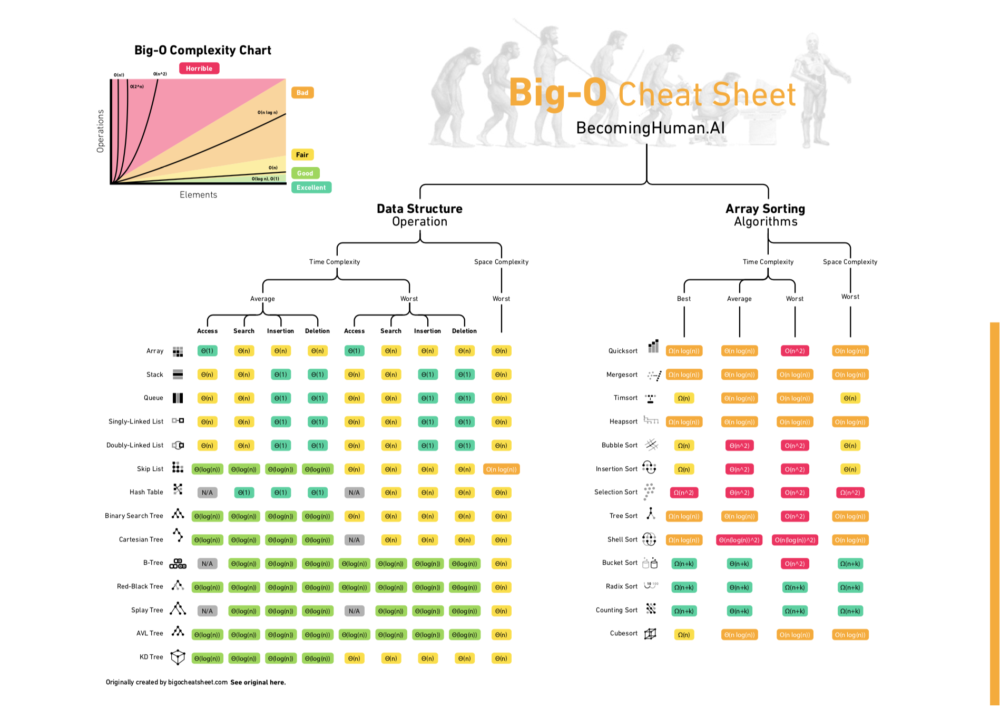

# 学习笔记 W1


## mindmap


## 算法分析

需要通过数学模型来描述：随着**问题规模**的增长，算法的运行成本（时间与空间）的**增长数据量级别**。

Θ 记号渐进的给出一个函数的上界和下界。 Ο 记号给出函数的**渐进上界**，而 Ω 记号给出函数的**渐进下界**。



- O(1):  Constant Complexity 常数复杂度
- O(log n):  Logarithmic Complexity 对数复杂度
- O(n):  Linear Complexity 线性时间复杂度
- O(n^2): N square Complexity 平方
- O(n^3): N cubic Complexity 立方
- O(2^n): Exponential Growth 指数。**递归**操作的时间复杂度为 `O(k^n)`。
- O(n!): Factorial 阶乘


## 数据结构

数据结构是指数据的组织和操作方式，其目的是找到使数据访问或操作更有效的方法。

###  数组 Array

数据是基于索引的数据结构，每个元素都有索引所引用。

数组的随机访问操作的时间复杂度是` O(1) `，插入、删除操作均为`O(n)`。


### 链表 Linked List

链表是一系列节点，其中每个节点都连接到其后的节点，形成了一个链式的存储结构。它的每个节点由数据元素和指向下一个节点的引用组成，此时为**单向链表**。如果每个节点同时还包含了指向前一个节点的引用，则称为**双向链表**。如果尾节点的后继节点引用指向了头节点，则称为**循环链表**。

链表的插入、删除操作的时间复杂度为`O(1)`，随机访问、搜索操作均为`O(n)`。


### 跳表 Skip List

跳表通过为原始链表建立多级索引的方式（设计思想：**升维 + 空间换时间**），以加速查询，其前提是链表的元素必须有序。其插入、删除、搜索的时间复杂度均为`O(logn)`，可用于替换平衡树（AVL Tree）和二分查找。


假如每2个节点抽取一个索引节点，则第k级索引的节点个数则为`n/2^k`，索引的高度（级）则为`log2(n)-1`，每层索引需要遍历的节点个数为3个，故查询任意数据的时间复杂度为`O(logn)`。


对于插入、删除操作，由于需要更新索引，维护成本较高，其时间复杂度由普通链表的`O(1)`降为`O(logn)`。


### 栈 Stack

栈是后进先出（LIFO）的数据结构，只能操作顶部的元素。通过`push`向栈的顶部压入（添加）元素，通过`pop`从栈的顶部弹出（移除）元素。添加、删除的时间复杂度均为`O(1)`。


**Java 接口与实现**

* `java.util.Stack` 
* `java.util.Deque` 接口
  * `java.util.ArrayDeque`
  * `java.util.LinkedList`
  * `java.util.concurrent.BlockingDeque`
  * `java.util.concurrent.ConcurrentLinkedDeque`
  * `java.util.concurrent.LinkedBlockingDeque`


**Stack**

`Stack`引入较早（JDK1.0），通过继承 `Vector`实现，不推荐使用。`Deque`接口及其实现提供了一个更完整和连贯的`LIFO`栈操作，应优先使用`Deque`。


### 队列 Queue

队列是先进先出（FIFO）的数据结构，从一端插入新元素，从另一端移除现有元素。添加、删除的时间复杂度均为`O(1)`。


**Java 接口与实现**

* `java.util.Queue` 接口，JDK 1.5 引入
  * `java.util.concurrent.ArrayBlockingQueue`
  * `java.util.ArrayDeque`
  * `java.util.concurrent.ConcurrentLinkedDeque`
  * `java.util.concurrent.ConcurrentLinkedQueue`
  * `java.util.concurrent.DelayQueue`
  * `java.util.concurrent.LinkedBlockingDeque`
  * `java.util.concurrent.LinkedBlockingQueue`
  * `java.util.LinkedList`  JDK 1.2 引入
  * `java.util.concurrent.LinkedTransferQueue`
  * `java.util.concurrent.PriorityBlockingQueue`
  * `java.util.PriorityQueue`
  * `java.util.concurrent.SynchronousQueue`


API 操作

| -       | Throws exception | Returns special value |
|---------|------------------|-----------------------|
| Insert  | add(e)           | offer(e)              |
| Remove  | remove()         | poll()                |
| Examine | element()        | peek()                |


#### 双端队列 Deque（Double-End Queue）

Deque 是一个两端都可以进出的 Queue，可以通过组合不同的操作来很容易地实现 Stack 和 Queue。添加、删除的时间复杂度均为`O(1)`。


**Java 接口与实现**

*  `java.util.Deque` JDK 1.6 引入
  * `java.util.ArrayDeque`
  * `java.util.LinkedList`  JDK 1.2 引入
  * `java.util.concurrent.ConcurrentLinkedDeque`
  * `java.util.concurrent.LinkedBlockingDeque`

Summary of Deque methods

| -       | Throws exception     | Special value        | Throws exception    | Special value       |
|---------|----------------------|----------------------|---------------------|---------------------|
| -       | First Element (Head) | First Element (Head) | Last Element (Tail) | Last Element (Tail) |
| Insert  | addFirst(e)          | offerFirst(e)        | addLast(e)          | offerLast(e)        |
| Remove  | removeFirst()        | pollFirst()          | removeLast()        | pollLast()          |
| Examine | getFirst()           | peekFirst()          | getLast()           | peekLast()          |

Comparison of Queue and Deque methods

| Queue Method | Equivalent Deque Method |
| ------------ | ----------------------- |
| add(e)       | addLast(e)              |
| offer(e)     | offerLast(e)            |
| remove()     | removeFirst()           |
| poll()       | pollFirst()             |
| element()    | getFirst()              |
| peek()       | peekFirst()             |

Comparison of Stack and Deque methods

| Stack Method | Equivalent Deque Method |
| ------------ | ----------------------- |
| push(e)      | addFirst(e)             |
| pop()        | removeFirst()           |
| peek()       | peekFirst()             |

API demo

```java
Deque<String> deque = new LinkedList<>();
deque.addFirst("a");
deque.addFirst("b");
deque.addFirst("c");
System.out.println(deque);

String str = deque.getFirst();
System.out.println(str);
System.out.println(deque);

while (deque.size() > 0) {
  System.out.println(deque.removeFirst());
}

System.out.println(deque);
```


**LinkedList**

`LinkedList` 的底层是一个双向链表，除了实现了`List`接口，还实现了`Deque`接口。


#### 优先队列 Priority Queue

优先队列是 Queue 的一种实现，每个元素都有与之关联的优先级，按元素的优先级顺序进行出队操作。添加的时间复杂度为`O(1)`，删除的时间复杂度为`O(logn)`。

底层有多种实现方式：heap、bst、treap。


**Java 实现**

* `java.util.PriorityQueue` JDK 1.5 引入


`PriorityQueue` 的底层是一个数组实现的**小顶堆**，整体不是有序的，只有堆顶存储着最小元素。入队即堆的插入实现，出队即堆的删除实现。

`PriorityQueue` 是非线程安全的。


  

## LeetCode


| # | Title | Solution | Difficulty |
|---| ----- | -------- | ---------- |
|283|[移动零](https://leetcode-cn.com/problems/move-zeroes/), [Move Zeroes](https://leetcode.com/problems/move-zeroes/) | [Java](./java/move-zeroes.java)|Easy|
|206|[反转链表](https://leetcode-cn.com/problems/reverse-linked-list/), [Reverse Linked List](https://leetcode.com/problems/reverse-linked-list/) | [Java](./java/reverse-linked-list.java)|Medium|
|189|[旋转数组](https://leetcode-cn.com/problems/rotate-array/), [Rotate Array](https://leetcode.com/problems/rotate-array/) | [Java](./java/rotate-array.java)|Easy|
|70|[爬楼梯](https://leetcode-cn.com/problems/climbing-stairs/), [Climbing Stairs](https://leetcode.com/problems/climbing-stairs/) | [Java](./java/climbing-stairs.java)|Easy|
|66|[加一](https://leetcode-cn.com/problems/plus-one/), [Plus One](https://leetcode.com/problems/plus-one/) | [Java](./java/plus-one.java)|Easy|
|26|[删除排序数组中的重复项](https://leetcode-cn.com/problems/remove-duplicates-from-sorted-array/), [Remove Duplicates from Sorted Array](https://leetcode.com/problems/remove-duplicates-from-sorted-array/) | [Java](./java/remove-duplicates-from-sorted-array.java)|Easy|
|24|[两两交换链表中的节点](https://leetcode-cn.com/problems/swap-nodes-in-pairs/), [Swap Nodes in Pairs](https://leetcode.com/problems/swap-nodes-in-pairs/) | [Java](./java/swap-nodes-in-pairs.java)|Medium|
|15|[三数之和](https://leetcode-cn.com/problems/3-sum/), [3 Sum](https://leetcode.com/problems/3-sum/) | [Java](./java/3-sum.java)|Medium|
|11|[盛最多水的容器](https://leetcode-cn.com/problems/container-with-most-water/), [Container With Most Water](https://leetcode.com/problems/container-with-most-water/) | [Java](./java/container-with-most-water.java)|Medium|
|1|[两数之和](https://leetcode-cn.com/problems/two-sum/), [Two Sum](https://leetcode.com/problems/two-sum/) | [Java](./java/two-sum.java)|Easy|


