# 学习笔记 W2

## LeetCode


| # | Title | Solution | Difficulty |
|---| ----- | -------- | ---------- |
|589|[N叉树的前序遍历](https://leetcode-cn.com/problems/n-ary-tree-preorder-traversal/) | [Java](./java/n-ary-tree-preorder-traversal.java)|Easy|
|412|[Fizz Buzz](https://leetcode-cn.com/problems/fizz-buzz/) | [Java](./java/fizz-buzz.java)|Easy|
|350|[两个数组的交集 II](https://leetcode-cn.com/problems/intersection-of-two-arrays-ii) | [Java](./java/intersection-of-two-arrays-ii.java)|Easy|
|242|[有效的字母异位词](https://leetcode-cn.com/problems/valid-anagram/) | [Java](./java/valid-anagram.java)|Easy|
|94|[二叉树的中序遍历](https://leetcode-cn.com/problems/binary-tree-inorder-traversal/) | [Java](./java/binary-tree-inorder-traversal.java)|Medium|

## 哈希表、映射、集合

哈希表（Hash table），也叫散列表，是根据关键码值（Key value）而直接进行访问的数据结构。 它通过把关键码值映射到表中一个位置来访问记录，以加快查找的速度。 这个映射函数叫作**散列函数**（Hash Function），存放记录的数组 叫作哈希表（或散列表）。

复杂度分析：
* 搜索、插入、删除的时间复杂度平均为O(1)，最差为O(n)
* 空间复杂度为O(n)

### 工程实践

* 缓存（LRU Cache）
* 键值对存储（Redis）

### Java接口及实现

`Map`接口实现：

**HashMap, Hashtable, ConcurrentHashMap**

[Map (Java SE 11 & JDK 11 )](https://docs.oracle.com/en/java/javase/11/docs/api/java.base/java/util/Map.html)

`Set`接口实现：

**TreeSet, HashSet**, ConcurrentSkipListSet, CopyOnWriteArraySet, EnumSet, JobState Reasons, LinkedHashSet

[Set (Java SE 11 & JDK 11 )](https://docs.oracle.com/en/java/javase/11/docs/api/java.base/java/util/Set.html)

### `java.util.HashMap` 原理及分析

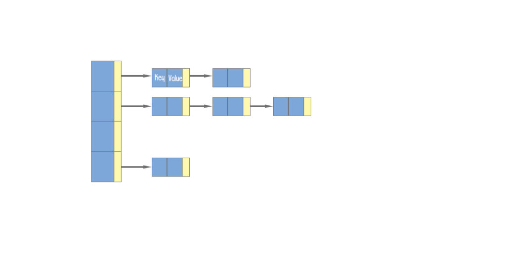

`HashMap`是以`Entry[]`数组实现的哈希桶数组，用`key`的哈希值（通过**哈希函数** `hash(Object key)`）去**模** 桶数组的大小可得到数组下标，即`(table.length - 1) & hash(key)`。

取模用**与**操作（`hash(key) & (arrayLength-1)`）会比较快，所以**数组的大小永远是 2 的 N 次方**， 你随便给一个初始值比如 17 会转为 32。默认第一次放入元素时的初始值是 16。

与数组长度做**与**操作带来的副作用是丢失高位的`hashCode`数据，比如初始数组长度16的二进制为`00000000 00000000 00001111`，**与**操作后，保留低4位，其他高位均归零，这样会加大碰撞的概率，所以需要对`hashCode`进行**扰动**后再使用。

```java
/**
 * 扰动函数（针对hashCode）
 * 右位移16位，正好是32bit的一半，自己的高16位和低16位做异或，是为了混合原始hashCode值的高位和低位，以此来加大低位的随机性。
 * 而且混合后的低位掺杂了高位的部分特征，这样高位的信息也被变相的保留下来。
 * JDK7做了4次右移，JDK8调整为只做一次右移。
 */
static final int hash(Object key) {
    int h;
    return (key == null) ? 0 : (h = key.hashCode()) ^ (h >>> 16);
}
```

插入元素时，如果两条`key`落在同一个桶（比如哈希值 1 和 17 取模 16 后都属于第一个哈希桶），我们称之为哈希冲突（Hash Collisions）。

JDK 的做法是链表法，`Entry`用一个`next`属性实现多个`Entry`以单向链表存放。查找哈希值为 17 的`key`时，先定位到哈希桶，然后链表遍历桶里所有元素，逐个比较其`hash`值（`hash(key)`），然后比较其`key`值（`== || equals`），均不同则插入链表尾部。

在 JDK8 里，新增默认为 8 的阀值，当一个桶里的`Entry`数量（即链表长度）超过阀值，就不以单向链表而以红黑树来存放以加快`key`的查找速度。

当然，最好还是桶里只有一个元素，不用去比较。所以默认当`Entry`数量达到桶数量的 75% （即负载因子）时，哈希冲突已比较严重，就会成倍扩容桶数组，并重新分配所有原来的`Entry`，称为`rehash`。扩容成本不低，所以初始化时最好有个预估值。

`rehash`在并发情况下可能会造成环形链表，造成`Infinite Loop`，导致 CPU 100%。
具体来说，两个多个线程去写（put），导致同时调用 `resize(int)`（其调用了`transfer`），会形成一个循环链表，此后再进行读（get）时会发生死循环。JDK 8 已经重写，修复了这个问题。

```java
void transfer(Entry[] newTable, boolean rehash) {
    int newCapacity = newTable.length;
    for (Entry<K,V> e : table) {
         while(null != e) {
             Entry<K,V> next = e.next;
             if (rehash) {
                 e.hash = null == e.key ? 0 : hash(e.key);
             }
             int i = indexFor(e.hash, newCapacity);
             // 下面两行逻辑颠倒了哈希存储桶中节点的顺序。两次同时逆转可以形成一个循环。
             e.next = newTable[i];
             newTable[i] = e;
             e = next;
         }
     }
 }
```

`iterator()`时顺着哈希桶数组来遍历，所以看起来是乱序的。

* [JDK 源码中 HashMap 的 hash 方法原理是什么？ - 知乎](https://www.zhihu.com/question/20733617)
* [multithreading - Java HashMap.get(Object) infinite loop - Stack Overflow](https://stackoverflow.com/questions/35534906/java-hashmap-getobject-infinite-loop)
- - - -

## 树、二叉树、二叉搜索树

### 树（Tree）

树由**结点**组成， 结点包含的链接可以为空 （null）或者指向其他结点。即树是由**边**连接的**节点**的**集合**。每个节点指向一定数量的节点。其表现为一个分层的图的形式。

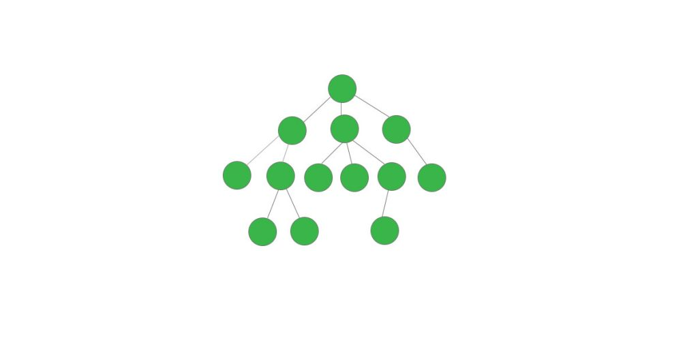

**树**结构要求不能形成环，如果存在环，则变为了**图**（Graph）结构。

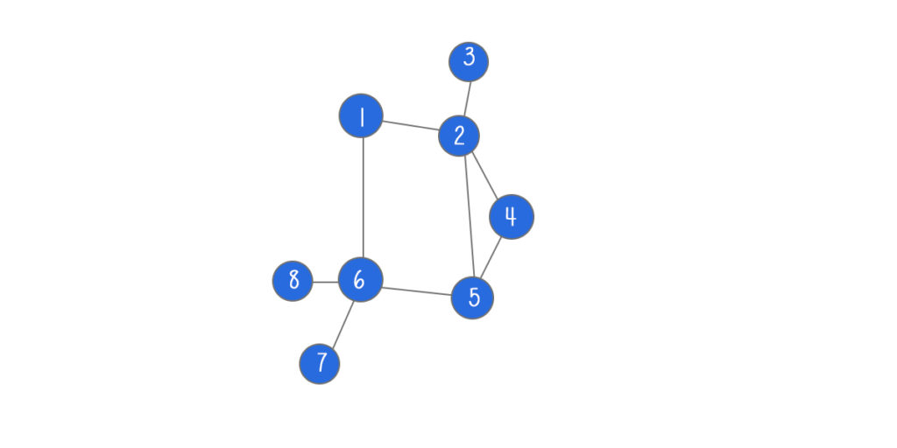

可以把**链表**看做是特殊化的**树**，而**树**是特殊化的**图**

### 二叉树（Binary Tree）

在二叉树中，每个结点只能有一个父结点（只有一个例外，也就是根结点， 它没有父结点） ， 而且每个结点都只有左右两个链接，分别指向自己的左子结点和右子结点。尽管链接指向的是结点，但我们可以将每个链接看做指向了另一棵二叉树（子树），而这棵树（子树）的根结点就是被指向的结点。

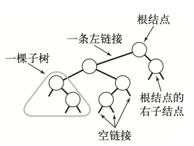

#### 二叉树遍历 Pre-order/In-order/Post-order

二叉树相比数组链表等结构无法有效地进行遍历，使用广度优先遍历（循环）相对麻烦，使用递归则相对容易，所以推荐使用递归。

1. 前序（Pre-order）：根-左-右 O(n)
2. 中序（In-order）：左-根-右 O(n)
3. 后序（Post-order）：左-右-根 O(n)

```python
def preorder(self, root):
    if root:
        self.traverse_path.append(root.val)
        self.preorder(root.left)
        elf.preorder(root.right)
def inorder(self, root):
    if root:
        self.inorder(root.left)
        self.traverse_path.append(root.val)
        self.inorder(root.right)
def postorder(self, root):
    if root:
        self.postorder(root.left)
        self.postorder(root.right)
        self.traverse_path.append(root.val)
```

#### 二叉查找树（BST，Binary Search Tree）

也叫二叉排序树（Sorted Binary Tree），有序二叉树（Ordered Binary Tree）。

在二叉查找树中，每个结点还包含了一个键和一个值，键之间也有顺序之分以支持高效的查找。

一棵二叉查找树 （BST） 是一棵二叉树， 其中每个结点都含有一个 Comparable 的键 （以及相关联的值）且每个结点的键都大于其左子树中的**任意**结点的键而小于右子树的**任意**结点的键。

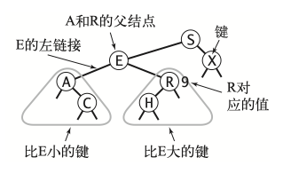


1. 左子树上**所有结点**的值均小于它的根结点的值； 
2. 右子树上所有结点的值均大于它的根结点的值； 
3. 以此类推：左、右子树也分别为二叉查找树。 （这就是 重复性！） 

结论：BST的**中序遍历**是**升序排列**的。

常见操作：
1. 查询  O(logn)
2. 插入新节点（创建） O(logn)
3. 删除 O(logn)

可视化 Demo: https://visualgo.net/zh/bst

- - - -
## 堆 Heap

**堆**是基于**树**的数据结构，其中树的所有节点都处于特定顺序。堆可以迅速找到一堆元素中的最大值或最小值。

将根节点最大的堆叫做大顶堆或大根堆，根节点最小的堆叫做小顶堆或小根堆。

常用的API （大根堆）：
```
find-max			// O(1)
delete-max		// O(logn)
insert(create)	// O(logn) or O(1)
```

常见的堆有二叉堆、斐波那契堆等。堆的实现有很多，二叉堆相对容易实现，但实现效率较低。工业级的应用一般会使用的效率更高的实现，如斐波拉切堆或严格的斐波拉切堆。

[Heap (data structure) - Wikipedia](https://en.wikipedia.org/wiki/Heap_(data_structure))

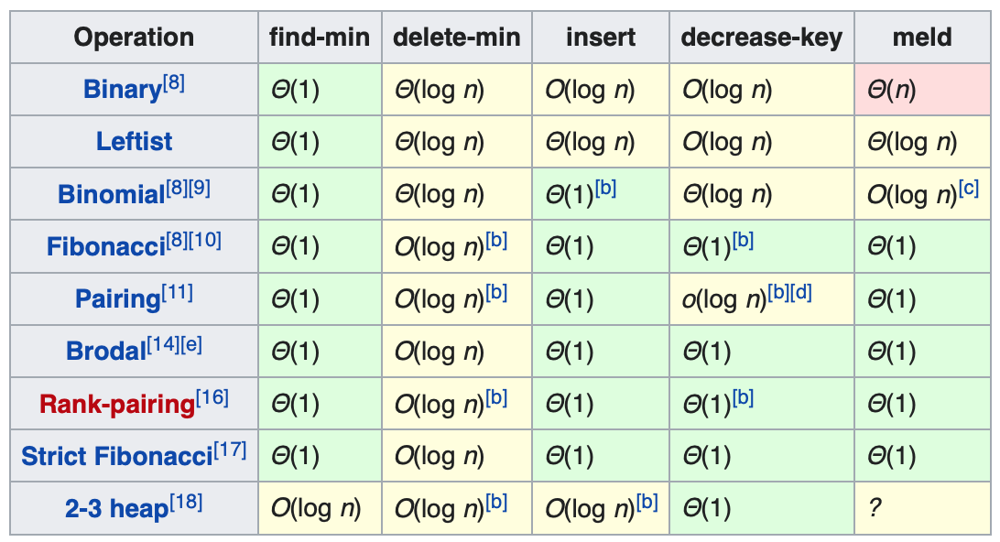

### 二叉堆 Binary Heap

通过完全二叉树来实现。注意不是BST。原因是为了让`find-max`的时间复杂度为O(1)，而使用 BST 则为 O(logn)。

>  完全树，它的根和每一级节点（除了最下面一层叶子节点）都是满的。  


二叉堆（大顶）满足下列性质：

1. 是一棵完全树
2. 存储在每个节点中的数据项大于或等于存储在其子节点中的数据项。

上述可以保证树的根节点就是最大值，之所以用树的结构，是为了其他的插入、删除操作也相对高效，至少是O(logn)的。


二叉堆是堆的一种常见且简单的实现，但是并不是最优的实现。Java 的 `PriorityQueue` 是通过二叉堆（小顶堆）实现的。


Max-Heap

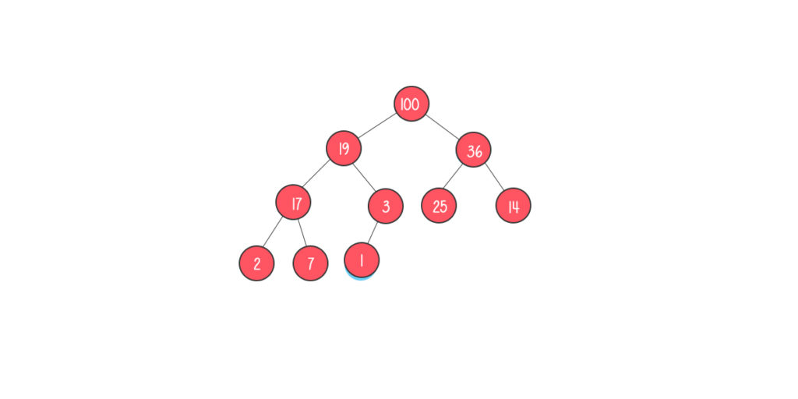

Min-Heap

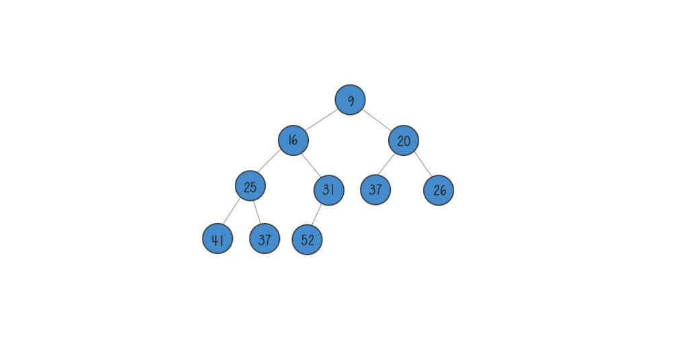

**实现细节：**

1. 二叉堆一般都通过**数组**来实现（因为是完全二叉树）
2. 假设第一个元素在数组中的索引为`0`的话, 则父节点和子节点的位置关系如下
	* 索引为`i`的左孩子的索引是 `(2*i+1)`
	* 索引为`i`的右孩子的索引是`(2*i+2)`
	* 索引为`i`的父结点的索引是 `floor((i-1)/2)`

**Insert**操作

1. 新元素一律先插入到堆的尾部
2. 依次向上调整整个堆的结构。即与其父节点进行比较，若大于父节点，则交换位置，否则终止。如此反复，一直到根即可。`HeapifyUp`

**Delete Max**删除堆顶操作
1. 将堆尾元素替换到顶部（即推顶元素被替代删除掉）
2. 依次从根部向下调整整个堆的结构，即与其子节点比较，若小于子节点，则与较大的那个子节点交换位置，否则终止。如此反复，一直到堆尾即可。`HeapifyDown`


- - - -

## 图 Graph

图包含一组**节点**和**边**。这些**节点**也被称为**顶点**`vertex`。**边**`edge`用来连接**节点**，**节点**用来存储和取回数据。

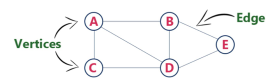

Graph(V, E)


V - `vertex`: 点
1. 度：入度和出度
2. 点与点之间：连通与否（点存在孤岛的情况也是允许的）


> 一个**点**所连接的**边**的数量为**度**。如果**边**有方向，指向节点的边的数量为**入度**  


E -`edge`: 边

1. 有向（单行线） 和无向
2. 权重（可以理解为边长或消耗）


**无向无权图**

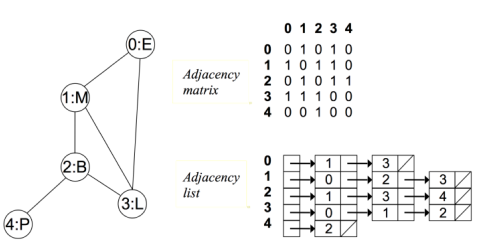

`Adjacency matrix` 邻接矩阵，行和列的下标均代表点，矩阵中的值表示两个点是否连接（0不连接；1连接），以对角线为轴对称（因为**无向**）。
`Adjacency list` 邻接表，对于每个点，与其相连的其他点，均以链表的形式存放。


**有向无权图**

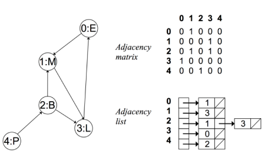

邻接矩阵不再以对角线为轴对称，因为**有向**。


**无向有权图**

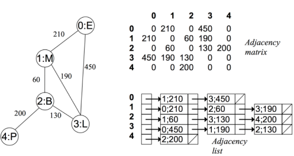

### 基于图的常见算法


**深度优先搜索（DFS）**

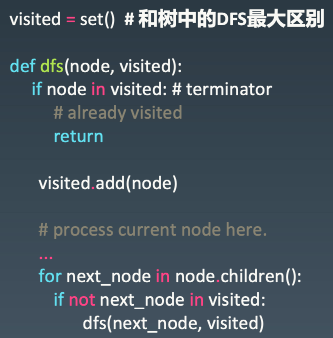


**广度优先搜索（BFS）**

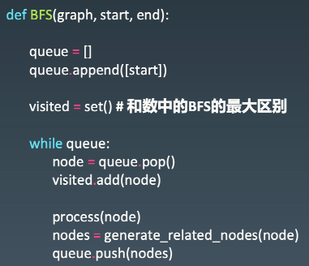


图的高级算法：

* [力扣-连通图的个数](https://leetcode-cn.com/problems/number-of-islands/)
* [拓扑排序的实现方法以及环路检测 - 知乎](https://zhuanlan.zhihu.com/p/34871092)
* [Python BFS和DFS算法（第3讲）—— 从BFS到Dijkstra算法_哔哩哔哩 (゜-゜)つロ 干杯~-bilibili](https://www.bilibili.com/video/av25829980?from=search&seid=13391343514095937158)
* [花花酱 LeetCode - 最小生成树 (Minimum Spanning Tree) 刷题找工作 SP18_哔哩哔哩 (゜-゜)つロ 干杯~-bilibili](https://www.bilibili.com/video/av84820276?from=search&seid=17476598104352152051)